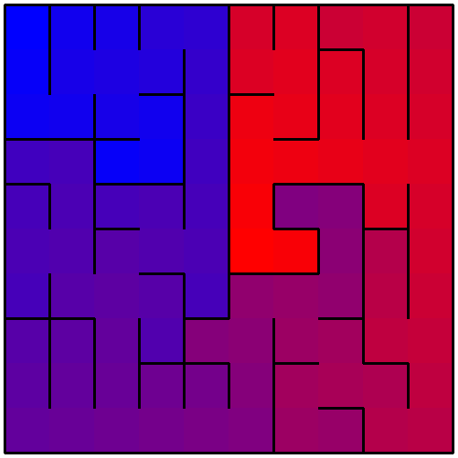
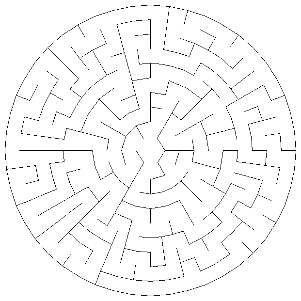

mazepy
=======

A maze library based off of the book [Mazes for Programmers](https://pragprog.com/titles/jbmaze/mazes-for-programmers/) by Jamis Buck but with more stuff.

Installation
```bash
pip install maze-py
```

Maze Shapes Supported
---------------------
#### 2D
* Rectangular
* Polar (Circular)
* Hexagonal
* Triangular
* Arbitrary shapes with masking
#### 3D
* Layers (Grid 3D)
* Cylindrical
* Spherical
* Cube
* Toroidal
* Möbius Strip

Generation Algorithms Supported
-------------------------------
* Aldous Broder
* Binary Tree (not triangular)
* Ellers (not triangular)
* Fractal Tesselation (only rectangualar)
* Growing Tree
* Hunt and Kill
* Kruskals (not polar, haxagonal, or triangular)
* Origin Shift
* Prims (Simplified, True, Modified)
* Recursive Backtrack (DFS)
* Recursive Division (only Rectangular)
* Sidewinder
* Wilsons

Other Features
--------------
* Printing rectangular mazes
* Generating pngs of mazes
* Color grids based on distance
* Viewing 3d grids in 3d
* Animations of maze creation and filling with color gradient


Examples
========
Printing a maze
---------------
```python
import mazepy as mp

grid = mp.grids.Grid(10,10)
mp.algorithms.HuntandKill(grid)
print(grid)
```
```
┌──────────────┬───────────────────┬──────────────┐  
│              │                   │              │  
│    ╶────┐    ╵    ╷    ╶────┬────┘    ┌────╴    │  
│         │         │         │         │         │  
│    ╷    └────┐    ├────╴    │    ┌────┘    ╶────┤  
│    │         │    │         │    │              │  
│    └────┐    └────┼─────────┘    ├─────────╴    │  
│         │         │              │              │  
│    ┌────┴────╴    │    ╷    ╶────┤    ╶─────────┤  
│    │              │    │         │              │  
├────┘    ┌─────────┘    ├────╴    ├─────────┐    │  
│         │              │         │         │    │  
│    ┌────┘    ┌─────────┴─────────┘    ╷    ╵    │  
│    │         │                        │         │  
│    ├─────────┘    ╷    ╶─────────┐    └─────────┤  
│    │              │              │              │  
│    ╵    ┌─────────┴────┐    ╷    ├────┬─────────┤  
│         │              │    │    │    │         │  
├─────────┘    ┌────╴    ╵    │    ╵    ╵    ╷    │  
│              │              │              │    │  
└──────────────┴──────────────┴──────────────┴────┘
```
Showing a colored maze
----------------------
```python
import mazepy as mp

grid = mp.grids.ColoredGrid(10,10, base='red', end='blue')
mp.algorithms.Ellers(grid)
grid.distances = grid[5, 5].distances()   # Set starting cell (this is required)
grid.show()
```



Mazes of different shapes
-------------------------
```python
import mazepy as mp

grid = mp.grids.PolarGrid(10)
mp.algorithms.RecursiveBacktrack(grid)
grid.show()
```
